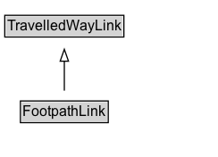

# FootpathLink

A directed footpath link between nodes.

## Diagram

=== "SVG (interactive)"

    <!-- Generated by graphviz version 14.1.3 (20260303.0454)
     -->
    <!-- Pages: 1 -->
    <svg width="183pt" height="132pt"
     viewBox="0.00 0.00 183.00 132.00" xmlns="http://www.w3.org/2000/svg" xmlns:xlink="http://www.w3.org/1999/xlink">
    <g id="graph0" class="graph" transform="scale(1 1) rotate(0) translate(4 128)">
    <polygon fill="white" stroke="none" points="-4,4 -4,-128 179,-128 179,4 -4,4"/>
    <g id="clust3" class="cluster">
    <title>cluster_associated</title>
    </g>
    <!-- TravelledWayLink -->
    <g id="node1" class="node">
    <title>TravelledWayLink</title>
    <g id="a_node1"><a xlink:href="../TravelledWayLink" xlink:title="&lt;TABLE&gt;">
    <polygon fill="lightgray" stroke="none" points="1,-97.88 1,-114.12 99,-114.12 99,-97.88 1,-97.88"/>
    <text xml:space="preserve" text-anchor="start" x="2" y="-101.88" font-family="Arial" font-size="12.00">TravelledWayLink</text>
    <polygon fill="none" stroke="black" points="0,-96.88 0,-115.12 100,-115.12 100,-96.88 0,-96.88"/>
    </a>
    </g>
    </g>
    <!-- FootpathLink -->
    <g id="node2" class="node">
    <title>FootpathLink</title>
    <g id="a_node2"><a xlink:href="../FootpathLink" xlink:title="&lt;TABLE&gt;">
    <polygon fill="lightgray" stroke="none" points="14.12,-25.88 14.12,-42.12 85.88,-42.12 85.88,-25.88 14.12,-25.88"/>
    <text xml:space="preserve" text-anchor="start" x="15.12" y="-29.88" font-family="Arial" font-size="12.00">FootpathLink</text>
    <polygon fill="none" stroke="black" points="13.12,-24.88 13.12,-43.12 86.88,-43.12 86.88,-24.88 13.12,-24.88"/>
    </a>
    </g>
    </g>
    <!-- FootpathLink&#45;&gt;TravelledWayLink -->
    <g id="edge1" class="edge">
    <title>FootpathLink&#45;&gt;TravelledWayLink</title>
    <path fill="none" stroke="black" d="M50,-51.79C50,-59.25 50,-68.24 50,-76.69"/>
    <polygon fill="none" stroke="black" points="46.5,-76.54 50,-86.54 53.5,-76.54 46.5,-76.54"/>
    </g>
    <!-- Invis -->
    </g>
    </svg>

=== "PNG"

    

## Formalization for FootpathLink

| Property | Constraint |
|----------|------------|
| subClassOf | [TravelledWayLink](TravelledWayLink.md) |

