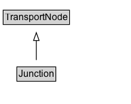

# Junction

A transport node where two or more travelled ways or links connect.

## Diagram

=== "SVG (interactive)"

    <!-- Generated by graphviz version 14.1.3 (20260303.0454)
     -->
    <!-- Pages: 1 -->
    <svg width="165pt" height="132pt"
     viewBox="0.00 0.00 165.00 132.00" xmlns="http://www.w3.org/2000/svg" xmlns:xlink="http://www.w3.org/1999/xlink">
    <g id="graph0" class="graph" transform="scale(1 1) rotate(0) translate(4 128)">
    <polygon fill="white" stroke="none" points="-4,4 -4,-128 160.75,-128 160.75,4 -4,4"/>
    <g id="clust3" class="cluster">
    <title>cluster_associated</title>
    </g>
    <!-- TransportNode -->
    <g id="node1" class="node">
    <title>TransportNode</title>
    <g id="a_node1"><a xlink:href="../TransportNode" xlink:title="&lt;TABLE&gt;">
    <polygon fill="lightgray" stroke="none" points="1,-97.88 1,-114.12 82.5,-114.12 82.5,-97.88 1,-97.88"/>
    <text xml:space="preserve" text-anchor="start" x="2" y="-101.88" font-family="Arial" font-size="12.00">TransportNode</text>
    <polygon fill="none" stroke="black" points="0,-96.88 0,-115.12 83.5,-115.12 83.5,-96.88 0,-96.88"/>
    </a>
    </g>
    </g>
    <!-- Junction -->
    <g id="node2" class="node">
    <title>Junction</title>
    <g id="a_node2"><a xlink:href="../Junction" xlink:title="&lt;TABLE&gt;">
    <polygon fill="lightgray" stroke="none" points="18.25,-25.88 18.25,-42.12 65.25,-42.12 65.25,-25.88 18.25,-25.88"/>
    <text xml:space="preserve" text-anchor="start" x="19.25" y="-29.88" font-family="Arial" font-size="12.00">Junction</text>
    <polygon fill="none" stroke="black" points="17.25,-24.88 17.25,-43.12 66.25,-43.12 66.25,-24.88 17.25,-24.88"/>
    </a>
    </g>
    </g>
    <!-- Junction&#45;&gt;TransportNode -->
    <g id="edge1" class="edge">
    <title>Junction&#45;&gt;TransportNode</title>
    <path fill="none" stroke="black" d="M41.75,-51.79C41.75,-59.25 41.75,-68.24 41.75,-76.69"/>
    <polygon fill="none" stroke="black" points="38.25,-76.54 41.75,-86.54 45.25,-76.54 38.25,-76.54"/>
    </g>
    <!-- Invis -->
    </g>
    </svg>

=== "PNG"

    

## Formalization for Junction

| Property | Constraint |
|----------|------------|
| subClassOf | [TransportNode](TransportNode.md) |

