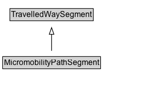

# MicromobilityPathSegment

A homogeneous segment of a micromobility path.

## Diagram

=== "SVG (interactive)"

    <!-- Generated by graphviz version 14.1.3 (20260303.0454)
     -->
    <!-- Pages: 1 -->
    <svg width="244pt" height="132pt"
     viewBox="0.00 0.00 244.00 132.00" xmlns="http://www.w3.org/2000/svg" xmlns:xlink="http://www.w3.org/1999/xlink">
    <g id="graph0" class="graph" transform="scale(1 1) rotate(0) translate(4 128)">
    <polygon fill="white" stroke="none" points="-4,4 -4,-128 239.62,-128 239.62,4 -4,4"/>
    <g id="clust3" class="cluster">
    <title>cluster_associated</title>
    </g>
    <!-- TravelledWaySegment -->
    <g id="node1" class="node">
    <title>TravelledWaySegment</title>
    <g id="a_node1"><a xlink:href="../TravelledWaySegment" xlink:title="&lt;TABLE&gt;">
    <polygon fill="lightgray" stroke="none" points="11.88,-97.88 11.88,-114.12 135.38,-114.12 135.38,-97.88 11.88,-97.88"/>
    <text xml:space="preserve" text-anchor="start" x="12.88" y="-101.88" font-family="Arial" font-size="12.00">TravelledWaySegment</text>
    <polygon fill="none" stroke="black" points="10.88,-96.88 10.88,-115.12 136.38,-115.12 136.38,-96.88 10.88,-96.88"/>
    </a>
    </g>
    </g>
    <!-- MicromobilityPathSegment -->
    <g id="node2" class="node">
    <title>MicromobilityPathSegment</title>
    <g id="a_node2"><a xlink:href="../MicromobilityPathSegment" xlink:title="&lt;TABLE&gt;">
    <polygon fill="lightgray" stroke="none" points="1,-25.88 1,-42.12 146.25,-42.12 146.25,-25.88 1,-25.88"/>
    <text xml:space="preserve" text-anchor="start" x="2" y="-29.88" font-family="Arial" font-size="12.00">MicromobilityPathSegment</text>
    <polygon fill="none" stroke="black" points="0,-24.88 0,-43.12 147.25,-43.12 147.25,-24.88 0,-24.88"/>
    </a>
    </g>
    </g>
    <!-- MicromobilityPathSegment&#45;&gt;TravelledWaySegment -->
    <g id="edge1" class="edge">
    <title>MicromobilityPathSegment&#45;&gt;TravelledWaySegment</title>
    <path fill="none" stroke="black" d="M73.62,-51.79C73.62,-59.25 73.62,-68.24 73.62,-76.69"/>
    <polygon fill="none" stroke="black" points="70.13,-76.54 73.63,-86.54 77.13,-76.54 70.13,-76.54"/>
    </g>
    <!-- Invis -->
    </g>
    </svg>

=== "PNG"

    

## Formalization for MicromobilityPathSegment

| Property | Constraint |
|----------|------------|
| subClassOf | [TravelledWaySegment](TravelledWaySegment.md) |

