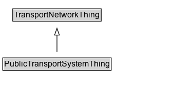

# PublicTransportSystemThing

Any public transport service or infrastructure feature.

## Diagram

=== "SVG (interactive)"

    <!-- Generated by graphviz version 14.1.3 (20260303.0454)
     -->
    <!-- Pages: 1 -->
    <svg width="254pt" height="132pt"
     viewBox="0.00 0.00 254.00 132.00" xmlns="http://www.w3.org/2000/svg" xmlns:xlink="http://www.w3.org/1999/xlink">
    <g id="graph0" class="graph" transform="scale(1 1) rotate(0) translate(4 128)">
    <polygon fill="white" stroke="none" points="-4,4 -4,-128 250.25,-128 250.25,4 -4,4"/>
    <g id="clust3" class="cluster">
    <title>cluster_associated</title>
    </g>
    <!-- TransportNetworkThing -->
    <g id="node1" class="node">
    <title>TransportNetworkThing</title>
    <g id="a_node1"><a xlink:href="../TransportNetworkThing" xlink:title="&lt;TABLE&gt;">
    <polygon fill="lightgray" stroke="none" points="15.62,-97.88 15.62,-114.12 142.88,-114.12 142.88,-97.88 15.62,-97.88"/>
    <text xml:space="preserve" text-anchor="start" x="16.62" y="-101.88" font-family="Arial" font-size="12.00">TransportNetworkThing</text>
    <polygon fill="none" stroke="black" points="14.62,-96.88 14.62,-115.12 143.88,-115.12 143.88,-96.88 14.62,-96.88"/>
    </a>
    </g>
    </g>
    <!-- PublicTransportSystemThing -->
    <g id="node2" class="node">
    <title>PublicTransportSystemThing</title>
    <g id="a_node2"><a xlink:href="../PublicTransportSystemThing" xlink:title="&lt;TABLE&gt;">
    <polygon fill="lightgray" stroke="none" points="1,-25.88 1,-42.12 157.5,-42.12 157.5,-25.88 1,-25.88"/>
    <text xml:space="preserve" text-anchor="start" x="2" y="-29.88" font-family="Arial" font-size="12.00">PublicTransportSystemThing</text>
    <polygon fill="none" stroke="black" points="0,-24.88 0,-43.12 158.5,-43.12 158.5,-24.88 0,-24.88"/>
    </a>
    </g>
    </g>
    <!-- PublicTransportSystemThing&#45;&gt;TransportNetworkThing -->
    <g id="edge1" class="edge">
    <title>PublicTransportSystemThing&#45;&gt;TransportNetworkThing</title>
    <path fill="none" stroke="black" d="M79.25,-51.79C79.25,-59.25 79.25,-68.24 79.25,-76.69"/>
    <polygon fill="none" stroke="black" points="75.75,-76.54 79.25,-86.54 82.75,-76.54 75.75,-76.54"/>
    </g>
    <!-- Invis -->
    </g>
    </svg>

=== "PNG"

    

## Specializations of PublicTransportSystemThing

| Class | Description |
|-------|-------------|
| [Group Of Lines](GroupOfLines.md) | A group of public transport lines modelled as an its-location:LocationGroup. |
| [Point On Route](PointOnRoute.md) | A point feature locating a stop, timing point, or other position on a route. |
| [Public Transport Element](PublicTransportElement.md) | Abstract element of a public transport system (line, route, stop, etc.). |
| [Public Transport Line](PublicTransportLine.md) | The linear geometry or reference for a public transport line (service corridor). |
| [Public Transport Route](PublicTransportRoute.md) | The linear geometry or reference for a specific public transport route variant. |
| [Public Transport System](PublicTransportSystem.md) | A transport network describing routes, lines, and related service elements of a public transport system. |
| [Route Point](RoutePoint.md) | A point feature along a route alignment (e.g., shape point or service point). |

## Formalization for PublicTransportSystemThing

| Property | Constraint |
|----------|------------|
| subClassOf | [TransportNetworkThing](TransportNetworkThing.md) |

