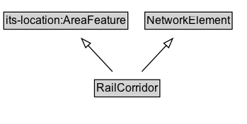

# RailCorridor

A two-dimensional rail corridor footprint or influence area.

## Diagram

=== "SVG (interactive)"

    <!-- Generated by graphviz version 14.1.3 (20260303.0454)
     -->
    <!-- Pages: 1 -->
    <svg width="262pt" height="132pt"
     viewBox="0.00 0.00 262.00 132.00" xmlns="http://www.w3.org/2000/svg" xmlns:xlink="http://www.w3.org/1999/xlink">
    <g id="graph0" class="graph" transform="scale(1 1) rotate(0) translate(4 128)">
    <polygon fill="white" stroke="none" points="-4,4 -4,-128 257.75,-128 257.75,4 -4,4"/>
    <g id="clust3" class="cluster">
    <title>cluster_associated</title>
    </g>
    <!-- its&#45;location_AreaFeature -->
    <g id="node1" class="node">
    <title>its&#45;location_AreaFeature</title>
    <g id="a_node1"><a xlink:href="https://w3id.org/itsdata/location/v1/AreaFeature" xlink:title="&lt;TABLE&gt;">
    <polygon fill="lightgray" stroke="none" points="1,-97.88 1,-114.12 130.5,-114.12 130.5,-97.88 1,-97.88"/>
    <text xml:space="preserve" text-anchor="start" x="2" y="-101.88" font-family="Arial" font-size="12.00">its&#45;location:AreaFeature</text>
    <polygon fill="none" stroke="black" points="0,-96.88 0,-115.12 131.5,-115.12 131.5,-96.88 0,-96.88"/>
    </a>
    </g>
    </g>
    <!-- NetworkElement -->
    <g id="node2" class="node">
    <title>NetworkElement</title>
    <g id="a_node2"><a xlink:href="../NetworkElement" xlink:title="&lt;TABLE&gt;">
    <polygon fill="lightgray" stroke="none" points="150.5,-97.88 150.5,-114.12 241,-114.12 241,-97.88 150.5,-97.88"/>
    <text xml:space="preserve" text-anchor="start" x="151.5" y="-101.88" font-family="Arial" font-size="12.00">NetworkElement</text>
    <polygon fill="none" stroke="black" points="149.5,-96.88 149.5,-115.12 242,-115.12 242,-96.88 149.5,-96.88"/>
    </a>
    </g>
    </g>
    <!-- RailCorridor -->
    <g id="node3" class="node">
    <title>RailCorridor</title>
    <g id="a_node3"><a xlink:href="../RailCorridor" xlink:title="&lt;TABLE&gt;">
    <polygon fill="lightgray" stroke="none" points="97.12,-25.88 97.12,-42.12 164.38,-42.12 164.38,-25.88 97.12,-25.88"/>
    <text xml:space="preserve" text-anchor="start" x="98.12" y="-29.88" font-family="Arial" font-size="12.00">RailCorridor</text>
    <polygon fill="none" stroke="black" points="96.12,-24.88 96.12,-43.12 165.38,-43.12 165.38,-24.88 96.12,-24.88"/>
    </a>
    </g>
    </g>
    <!-- RailCorridor&#45;&gt;its&#45;location_AreaFeature -->
    <g id="edge1" class="edge">
    <title>RailCorridor&#45;&gt;its&#45;location_AreaFeature</title>
    <path fill="none" stroke="black" d="M115.16,-51.79C107.36,-60.19 97.75,-70.53 89.09,-79.86"/>
    <polygon fill="none" stroke="black" points="86.75,-77.24 82.51,-86.95 91.88,-82 86.75,-77.24"/>
    </g>
    <!-- RailCorridor&#45;&gt;NetworkElement -->
    <g id="edge2" class="edge">
    <title>RailCorridor&#45;&gt;NetworkElement</title>
    <path fill="none" stroke="black" d="M146.34,-51.79C154.14,-60.19 163.75,-70.53 172.41,-79.86"/>
    <polygon fill="none" stroke="black" points="169.62,-82 178.99,-86.95 174.75,-77.24 169.62,-82"/>
    </g>
    <!-- Invis -->
    </g>
    </svg>

=== "PNG"

    

## Formalization for RailCorridor

| Property | Constraint |
|----------|------------|
| subClassOf | [its-location:AreaFeature](https://w3id.org/itsdata/location/v1/AreaFeature) |
| subClassOf | [NetworkElement](NetworkElement.md) |

