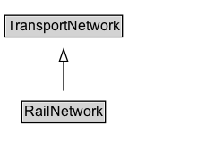

# RailNetwork

A transport network for rail infrastructure.

## Diagram

=== "SVG (interactive)"

    <!-- Generated by graphviz version 14.1.3 (20260303.0454)
     -->
    <!-- Pages: 1 -->
    <svg width="180pt" height="132pt"
     viewBox="0.00 0.00 180.00 132.00" xmlns="http://www.w3.org/2000/svg" xmlns:xlink="http://www.w3.org/1999/xlink">
    <g id="graph0" class="graph" transform="scale(1 1) rotate(0) translate(4 128)">
    <polygon fill="white" stroke="none" points="-4,4 -4,-128 176.25,-128 176.25,4 -4,4"/>
    <g id="clust3" class="cluster">
    <title>cluster_associated</title>
    </g>
    <!-- TransportNetwork -->
    <g id="node1" class="node">
    <title>TransportNetwork</title>
    <g id="a_node1"><a xlink:href="../TransportNetwork" xlink:title="&lt;TABLE&gt;">
    <polygon fill="lightgray" stroke="none" points="1,-97.88 1,-114.12 97.5,-114.12 97.5,-97.88 1,-97.88"/>
    <text xml:space="preserve" text-anchor="start" x="2" y="-101.88" font-family="Arial" font-size="12.00">TransportNetwork</text>
    <polygon fill="none" stroke="black" points="0,-96.88 0,-115.12 98.5,-115.12 98.5,-96.88 0,-96.88"/>
    </a>
    </g>
    </g>
    <!-- RailNetwork -->
    <g id="node2" class="node">
    <title>RailNetwork</title>
    <g id="a_node2"><a xlink:href="../RailNetwork" xlink:title="&lt;TABLE&gt;">
    <polygon fill="lightgray" stroke="none" points="15.25,-25.88 15.25,-42.12 83.25,-42.12 83.25,-25.88 15.25,-25.88"/>
    <text xml:space="preserve" text-anchor="start" x="16.25" y="-29.88" font-family="Arial" font-size="12.00">RailNetwork</text>
    <polygon fill="none" stroke="black" points="14.25,-24.88 14.25,-43.12 84.25,-43.12 84.25,-24.88 14.25,-24.88"/>
    </a>
    </g>
    </g>
    <!-- RailNetwork&#45;&gt;TransportNetwork -->
    <g id="edge1" class="edge">
    <title>RailNetwork&#45;&gt;TransportNetwork</title>
    <path fill="none" stroke="black" d="M49.25,-51.79C49.25,-59.25 49.25,-68.24 49.25,-76.69"/>
    <polygon fill="none" stroke="black" points="45.75,-76.54 49.25,-86.54 52.75,-76.54 45.75,-76.54"/>
    </g>
    <!-- Invis -->
    </g>
    </svg>

=== "PNG"

    

## Formalization for RailNetwork

| Property | Constraint |
|----------|------------|
| subClassOf | [TransportNetwork](TransportNetwork.md) |

