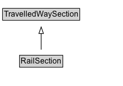

# RailSection

A contiguous section of a rail alignment.

## Diagram

=== "SVG (interactive)"

    <!-- Generated by graphviz version 14.1.3 (20260303.0454)
     -->
    <!-- Pages: 1 -->
    <svg width="188pt" height="132pt"
     viewBox="0.00 0.00 188.00 132.00" xmlns="http://www.w3.org/2000/svg" xmlns:xlink="http://www.w3.org/1999/xlink">
    <g id="graph0" class="graph" transform="scale(1 1) rotate(0) translate(4 128)">
    <polygon fill="white" stroke="none" points="-4,4 -4,-128 184,-128 184,4 -4,4"/>
    <g id="clust3" class="cluster">
    <title>cluster_associated</title>
    </g>
    <!-- TravelledWaySection -->
    <g id="node1" class="node">
    <title>TravelledWaySection</title>
    <g id="a_node1"><a xlink:href="../TravelledWaySection" xlink:title="&lt;TABLE&gt;">
    <polygon fill="lightgray" stroke="none" points="1,-97.88 1,-114.12 117,-114.12 117,-97.88 1,-97.88"/>
    <text xml:space="preserve" text-anchor="start" x="2" y="-101.88" font-family="Arial" font-size="12.00">TravelledWaySection</text>
    <polygon fill="none" stroke="black" points="0,-96.88 0,-115.12 118,-115.12 118,-96.88 0,-96.88"/>
    </a>
    </g>
    </g>
    <!-- RailSection -->
    <g id="node2" class="node">
    <title>RailSection</title>
    <g id="a_node2"><a xlink:href="../RailSection" xlink:title="&lt;TABLE&gt;">
    <polygon fill="lightgray" stroke="none" points="26.88,-25.88 26.88,-42.12 91.12,-42.12 91.12,-25.88 26.88,-25.88"/>
    <text xml:space="preserve" text-anchor="start" x="27.88" y="-29.88" font-family="Arial" font-size="12.00">RailSection</text>
    <polygon fill="none" stroke="black" points="25.88,-24.88 25.88,-43.12 92.12,-43.12 92.12,-24.88 25.88,-24.88"/>
    </a>
    </g>
    </g>
    <!-- RailSection&#45;&gt;TravelledWaySection -->
    <g id="edge1" class="edge">
    <title>RailSection&#45;&gt;TravelledWaySection</title>
    <path fill="none" stroke="black" d="M59,-51.79C59,-59.25 59,-68.24 59,-76.69"/>
    <polygon fill="none" stroke="black" points="55.5,-76.54 59,-86.54 62.5,-76.54 55.5,-76.54"/>
    </g>
    <!-- Invis -->
    </g>
    </svg>

=== "PNG"

    

## Formalization for RailSection

| Property | Constraint |
|----------|------------|
| subClassOf | [TravelledWaySection](TravelledWaySection.md) |

