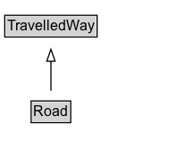

# Road

A travelled way intended for motor vehicle or mixed road traffic.

## Diagram

=== "SVG (interactive)"

    <!-- Generated by graphviz version 14.1.3 (20260303.0454)
     -->
    <!-- Pages: 1 -->
    <svg width="162pt" height="132pt"
     viewBox="0.00 0.00 162.00 132.00" xmlns="http://www.w3.org/2000/svg" xmlns:xlink="http://www.w3.org/1999/xlink">
    <g id="graph0" class="graph" transform="scale(1 1) rotate(0) translate(4 128)">
    <polygon fill="white" stroke="none" points="-4,4 -4,-128 157.75,-128 157.75,4 -4,4"/>
    <g id="clust3" class="cluster">
    <title>cluster_associated</title>
    </g>
    <!-- TravelledWay -->
    <g id="node1" class="node">
    <title>TravelledWay</title>
    <g id="a_node1"><a xlink:href="../TravelledWay" xlink:title="&lt;TABLE&gt;">
    <polygon fill="lightgray" stroke="none" points="1,-97.88 1,-114.12 76.5,-114.12 76.5,-97.88 1,-97.88"/>
    <text xml:space="preserve" text-anchor="start" x="2" y="-101.88" font-family="Arial" font-size="12.00">TravelledWay</text>
    <polygon fill="none" stroke="black" points="0,-96.88 0,-115.12 77.5,-115.12 77.5,-96.88 0,-96.88"/>
    </a>
    </g>
    </g>
    <!-- Road -->
    <g id="node2" class="node">
    <title>Road</title>
    <g id="a_node2"><a xlink:href="../Road" xlink:title="&lt;TABLE&gt;">
    <polygon fill="lightgray" stroke="none" points="23.12,-25.88 23.12,-42.12 54.38,-42.12 54.38,-25.88 23.12,-25.88"/>
    <text xml:space="preserve" text-anchor="start" x="24.12" y="-29.88" font-family="Arial" font-size="12.00">Road</text>
    <polygon fill="none" stroke="black" points="22.12,-24.88 22.12,-43.12 55.38,-43.12 55.38,-24.88 22.12,-24.88"/>
    </a>
    </g>
    </g>
    <!-- Road&#45;&gt;TravelledWay -->
    <g id="edge1" class="edge">
    <title>Road&#45;&gt;TravelledWay</title>
    <path fill="none" stroke="black" d="M38.75,-51.79C38.75,-59.25 38.75,-68.24 38.75,-76.69"/>
    <polygon fill="none" stroke="black" points="35.25,-76.54 38.75,-86.54 42.25,-76.54 35.25,-76.54"/>
    </g>
    <!-- Invis -->
    </g>
    </svg>

=== "PNG"

    

## Formalization for Road

| Property | Constraint |
|----------|------------|
| subClassOf | [TravelledWay](TravelledWay.md) |

