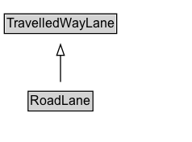

# RoadLane

A lane along a road.

## Diagram

=== "SVG (interactive)"

    <!-- Generated by graphviz version 14.1.3 (20260303.0454)
     -->
    <!-- Pages: 1 -->
    <svg width="178pt" height="132pt"
     viewBox="0.00 0.00 178.00 132.00" xmlns="http://www.w3.org/2000/svg" xmlns:xlink="http://www.w3.org/1999/xlink">
    <g id="graph0" class="graph" transform="scale(1 1) rotate(0) translate(4 128)">
    <polygon fill="white" stroke="none" points="-4,4 -4,-128 174.25,-128 174.25,4 -4,4"/>
    <g id="clust3" class="cluster">
    <title>cluster_associated</title>
    </g>
    <!-- TravelledWayLane -->
    <g id="node1" class="node">
    <title>TravelledWayLane</title>
    <g id="a_node1"><a xlink:href="../TravelledWayLane" xlink:title="&lt;TABLE&gt;">
    <polygon fill="lightgray" stroke="none" points="1,-97.88 1,-114.12 103.5,-114.12 103.5,-97.88 1,-97.88"/>
    <text xml:space="preserve" text-anchor="start" x="2" y="-101.88" font-family="Arial" font-size="12.00">TravelledWayLane</text>
    <polygon fill="none" stroke="black" points="0,-96.88 0,-115.12 104.5,-115.12 104.5,-96.88 0,-96.88"/>
    </a>
    </g>
    </g>
    <!-- RoadLane -->
    <g id="node2" class="node">
    <title>RoadLane</title>
    <g id="a_node2"><a xlink:href="../RoadLane" xlink:title="&lt;TABLE&gt;">
    <polygon fill="lightgray" stroke="none" points="23.12,-25.88 23.12,-42.12 81.38,-42.12 81.38,-25.88 23.12,-25.88"/>
    <text xml:space="preserve" text-anchor="start" x="24.12" y="-29.88" font-family="Arial" font-size="12.00">RoadLane</text>
    <polygon fill="none" stroke="black" points="22.12,-24.88 22.12,-43.12 82.38,-43.12 82.38,-24.88 22.12,-24.88"/>
    </a>
    </g>
    </g>
    <!-- RoadLane&#45;&gt;TravelledWayLane -->
    <g id="edge1" class="edge">
    <title>RoadLane&#45;&gt;TravelledWayLane</title>
    <path fill="none" stroke="black" d="M52.25,-51.79C52.25,-59.25 52.25,-68.24 52.25,-76.69"/>
    <polygon fill="none" stroke="black" points="48.75,-76.54 52.25,-86.54 55.75,-76.54 48.75,-76.54"/>
    </g>
    <!-- Invis -->
    </g>
    </svg>

=== "PNG"

    

## Formalization for RoadLane

| Property | Constraint |
|----------|------------|
| subClassOf | [TravelledWayLane](TravelledWayLane.md) |

