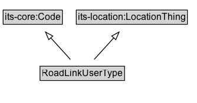

# RoadLinkUserType

A code classifying users permitted or typical on a road link.

## Diagram

=== "SVG (interactive)"

    <!-- Generated by graphviz version 14.1.3 (20260303.0454)
     -->
    <!-- Pages: 1 -->
    <svg width="251pt" height="132pt"
     viewBox="0.00 0.00 251.00 132.00" xmlns="http://www.w3.org/2000/svg" xmlns:xlink="http://www.w3.org/1999/xlink">
    <g id="graph0" class="graph" transform="scale(1 1) rotate(0) translate(4 128)">
    <polygon fill="white" stroke="none" points="-4,4 -4,-128 246.62,-128 246.62,4 -4,4"/>
    <g id="clust3" class="cluster">
    <title>cluster_associated</title>
    </g>
    <!-- its&#45;core_Code -->
    <g id="node1" class="node">
    <title>its&#45;core_Code</title>
    <g id="a_node1"><a xlink:href="https://w3id.org/itsdata/core/v1/Code" xlink:title="&lt;TABLE&gt;">
    <polygon fill="lightgray" stroke="none" points="1,-97.88 1,-114.12 74.25,-114.12 74.25,-97.88 1,-97.88"/>
    <text xml:space="preserve" text-anchor="start" x="2" y="-101.88" font-family="Arial" font-size="12.00">its&#45;core:Code</text>
    <polygon fill="none" stroke="black" points="0,-96.88 0,-115.12 75.25,-115.12 75.25,-96.88 0,-96.88"/>
    </a>
    </g>
    </g>
    <!-- its&#45;location_LocationThing -->
    <g id="node2" class="node">
    <title>its&#45;location_LocationThing</title>
    <g id="a_node2"><a xlink:href="https://w3id.org/itsdata/location/v1/LocationThing" xlink:title="&lt;TABLE&gt;">
    <polygon fill="lightgray" stroke="none" points="94,-97.88 94,-114.12 233.25,-114.12 233.25,-97.88 94,-97.88"/>
    <text xml:space="preserve" text-anchor="start" x="95" y="-101.88" font-family="Arial" font-size="12.00">its&#45;location:LocationThing</text>
    <polygon fill="none" stroke="black" points="93,-96.88 93,-115.12 234.25,-115.12 234.25,-96.88 93,-96.88"/>
    </a>
    </g>
    </g>
    <!-- RoadLinkUserType -->
    <g id="node3" class="node">
    <title>RoadLinkUserType</title>
    <g id="a_node3"><a xlink:href="../RoadLinkUserType" xlink:title="&lt;TABLE&gt;">
    <polygon fill="lightgray" stroke="none" points="47.88,-25.88 47.88,-42.12 153.38,-42.12 153.38,-25.88 47.88,-25.88"/>
    <text xml:space="preserve" text-anchor="start" x="48.88" y="-29.88" font-family="Arial" font-size="12.00">RoadLinkUserType</text>
    <polygon fill="none" stroke="black" points="46.88,-24.88 46.88,-43.12 154.38,-43.12 154.38,-24.88 46.88,-24.88"/>
    </a>
    </g>
    </g>
    <!-- RoadLinkUserType&#45;&gt;its&#45;core_Code -->
    <g id="edge1" class="edge">
    <title>RoadLinkUserType&#45;&gt;its&#45;core_Code</title>
    <path fill="none" stroke="black" d="M85.51,-51.79C78.03,-60.11 68.83,-70.32 60.51,-79.58"/>
    <polygon fill="none" stroke="black" points="57.98,-77.16 53.89,-86.93 63.18,-81.84 57.98,-77.16"/>
    </g>
    <!-- RoadLinkUserType&#45;&gt;its&#45;location_LocationThing -->
    <g id="edge2" class="edge">
    <title>RoadLinkUserType&#45;&gt;its&#45;location_LocationThing</title>
    <path fill="none" stroke="black" d="M115.74,-51.79C123.22,-60.11 132.42,-70.32 140.74,-79.58"/>
    <polygon fill="none" stroke="black" points="138.07,-81.84 147.36,-86.93 143.27,-77.16 138.07,-81.84"/>
    </g>
    <!-- Invis -->
    </g>
    </svg>

=== "PNG"

    

## Formalization for RoadLinkUserType

| Property | Constraint |
|----------|------------|
| subClassOf | [its-location:LocationThing](https://w3id.org/itsdata/location/v1/LocationThing) |
| subClassOf | [its-core:Code](https://w3id.org/itsdata/core/v1/Code) |

