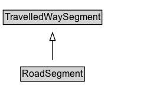

# RoadSegment

A homogeneous segment of a road.

## Diagram

=== "SVG (interactive)"

    <!-- Generated by graphviz version 14.1.3 (20260303.0454)
     -->
    <!-- Pages: 1 -->
    <svg width="200pt" height="132pt"
     viewBox="0.00 0.00 200.00 132.00" xmlns="http://www.w3.org/2000/svg" xmlns:xlink="http://www.w3.org/1999/xlink">
    <g id="graph0" class="graph" transform="scale(1 1) rotate(0) translate(4 128)">
    <polygon fill="white" stroke="none" points="-4,4 -4,-128 195.75,-128 195.75,4 -4,4"/>
    <g id="clust3" class="cluster">
    <title>cluster_associated</title>
    </g>
    <!-- TravelledWaySegment -->
    <g id="node1" class="node">
    <title>TravelledWaySegment</title>
    <g id="a_node1"><a xlink:href="../TravelledWaySegment" xlink:title="&lt;TABLE&gt;">
    <polygon fill="lightgray" stroke="none" points="1,-97.88 1,-114.12 124.5,-114.12 124.5,-97.88 1,-97.88"/>
    <text xml:space="preserve" text-anchor="start" x="2" y="-101.88" font-family="Arial" font-size="12.00">TravelledWaySegment</text>
    <polygon fill="none" stroke="black" points="0,-96.88 0,-115.12 125.5,-115.12 125.5,-96.88 0,-96.88"/>
    </a>
    </g>
    </g>
    <!-- RoadSegment -->
    <g id="node2" class="node">
    <title>RoadSegment</title>
    <g id="a_node2"><a xlink:href="../RoadSegment" xlink:title="&lt;TABLE&gt;">
    <polygon fill="lightgray" stroke="none" points="23.12,-25.88 23.12,-42.12 102.38,-42.12 102.38,-25.88 23.12,-25.88"/>
    <text xml:space="preserve" text-anchor="start" x="24.12" y="-29.88" font-family="Arial" font-size="12.00">RoadSegment</text>
    <polygon fill="none" stroke="black" points="22.12,-24.88 22.12,-43.12 103.38,-43.12 103.38,-24.88 22.12,-24.88"/>
    </a>
    </g>
    </g>
    <!-- RoadSegment&#45;&gt;TravelledWaySegment -->
    <g id="edge1" class="edge">
    <title>RoadSegment&#45;&gt;TravelledWaySegment</title>
    <path fill="none" stroke="black" d="M62.75,-51.79C62.75,-59.25 62.75,-68.24 62.75,-76.69"/>
    <polygon fill="none" stroke="black" points="59.25,-76.54 62.75,-86.54 66.25,-76.54 59.25,-76.54"/>
    </g>
    <!-- Invis -->
    </g>
    </svg>

=== "PNG"

    

## Formalization for RoadSegment

| Property | Constraint |
|----------|------------|
| subClassOf | [TravelledWaySegment](TravelledWaySegment.md) |

