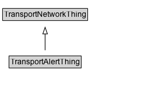

# TransportAlertThing

Any transport-related alerting or event feature.

## Diagram

=== "SVG (interactive)"

    <!-- Generated by graphviz version 14.1.3 (20260303.0454)
     -->
    <!-- Pages: 1 -->
    <svg width="216pt" height="132pt"
     viewBox="0.00 0.00 216.00 132.00" xmlns="http://www.w3.org/2000/svg" xmlns:xlink="http://www.w3.org/1999/xlink">
    <g id="graph0" class="graph" transform="scale(1 1) rotate(0) translate(4 128)">
    <polygon fill="white" stroke="none" points="-4,4 -4,-128 211.62,-128 211.62,4 -4,4"/>
    <g id="clust3" class="cluster">
    <title>cluster_associated</title>
    </g>
    <!-- TransportNetworkThing -->
    <g id="node1" class="node">
    <title>TransportNetworkThing</title>
    <g id="a_node1"><a xlink:href="../TransportNetworkThing" xlink:title="&lt;TABLE&gt;">
    <polygon fill="lightgray" stroke="none" points="1,-97.88 1,-114.12 128.25,-114.12 128.25,-97.88 1,-97.88"/>
    <text xml:space="preserve" text-anchor="start" x="2" y="-101.88" font-family="Arial" font-size="12.00">TransportNetworkThing</text>
    <polygon fill="none" stroke="black" points="0,-96.88 0,-115.12 129.25,-115.12 129.25,-96.88 0,-96.88"/>
    </a>
    </g>
    </g>
    <!-- TransportAlertThing -->
    <g id="node2" class="node">
    <title>TransportAlertThing</title>
    <g id="a_node2"><a xlink:href="../TransportAlertThing" xlink:title="&lt;TABLE&gt;">
    <polygon fill="lightgray" stroke="none" points="10.75,-25.88 10.75,-42.12 118.5,-42.12 118.5,-25.88 10.75,-25.88"/>
    <text xml:space="preserve" text-anchor="start" x="11.75" y="-29.88" font-family="Arial" font-size="12.00">TransportAlertThing</text>
    <polygon fill="none" stroke="black" points="9.75,-24.88 9.75,-43.12 119.5,-43.12 119.5,-24.88 9.75,-24.88"/>
    </a>
    </g>
    </g>
    <!-- TransportAlertThing&#45;&gt;TransportNetworkThing -->
    <g id="edge1" class="edge">
    <title>TransportAlertThing&#45;&gt;TransportNetworkThing</title>
    <path fill="none" stroke="black" d="M64.62,-51.79C64.62,-59.25 64.62,-68.24 64.62,-76.69"/>
    <polygon fill="none" stroke="black" points="61.13,-76.54 64.63,-86.54 68.13,-76.54 61.13,-76.54"/>
    </g>
    <!-- Invis -->
    </g>
    </svg>

=== "PNG"

    

## Specializations of TransportAlertThing

| Class | Description |
|-------|-------------|
| [Transport Alert](TransportAlert.md) | A feature representing a transport alert with spatial extent described by ITS Location geometries. |

## Formalization for TransportAlertThing

| Property | Constraint |
|----------|------------|
| subClassOf | [TransportNetworkThing](TransportNetworkThing.md) |

