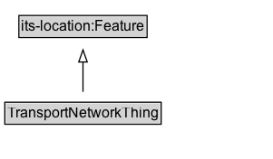

# TransportNetworkThing

Any transport-related geographic feature in the ITS transport-network domain. Subclass of its-location:Feature (and therefore geo:Feature).

## Diagram

=== "SVG (interactive)"

    <!-- Generated by graphviz version 14.1.3 (20260303.0454)
     -->
    <!-- Pages: 1 -->
    <svg width="226pt" height="132pt"
     viewBox="0.00 0.00 226.00 132.00" xmlns="http://www.w3.org/2000/svg" xmlns:xlink="http://www.w3.org/1999/xlink">
    <g id="graph0" class="graph" transform="scale(1 1) rotate(0) translate(4 128)">
    <polygon fill="white" stroke="none" points="-4,4 -4,-128 221.62,-128 221.62,4 -4,4"/>
    <g id="clust3" class="cluster">
    <title>cluster_associated</title>
    </g>
    <!-- its&#45;location_Feature -->
    <g id="node1" class="node">
    <title>its&#45;location_Feature</title>
    <g id="a_node1"><a xlink:href="https://w3id.org/itsdata/location/v1/Feature" xlink:title="&lt;TABLE&gt;">
    <polygon fill="lightgray" stroke="none" points="12.62,-97.88 12.62,-114.12 116.62,-114.12 116.62,-97.88 12.62,-97.88"/>
    <text xml:space="preserve" text-anchor="start" x="13.62" y="-101.88" font-family="Arial" font-size="12.00">its&#45;location:Feature</text>
    <polygon fill="none" stroke="black" points="11.62,-96.88 11.62,-115.12 117.62,-115.12 117.62,-96.88 11.62,-96.88"/>
    </a>
    </g>
    </g>
    <!-- TransportNetworkThing -->
    <g id="node2" class="node">
    <title>TransportNetworkThing</title>
    <g id="a_node2"><a xlink:href="../TransportNetworkThing" xlink:title="&lt;TABLE&gt;">
    <polygon fill="lightgray" stroke="none" points="1,-25.88 1,-42.12 128.25,-42.12 128.25,-25.88 1,-25.88"/>
    <text xml:space="preserve" text-anchor="start" x="2" y="-29.88" font-family="Arial" font-size="12.00">TransportNetworkThing</text>
    <polygon fill="none" stroke="black" points="0,-24.88 0,-43.12 129.25,-43.12 129.25,-24.88 0,-24.88"/>
    </a>
    </g>
    </g>
    <!-- TransportNetworkThing&#45;&gt;its&#45;location_Feature -->
    <g id="edge1" class="edge">
    <title>TransportNetworkThing&#45;&gt;its&#45;location_Feature</title>
    <path fill="none" stroke="black" d="M64.62,-51.79C64.62,-59.25 64.62,-68.24 64.62,-76.69"/>
    <polygon fill="none" stroke="black" points="61.13,-76.54 64.63,-86.54 68.13,-76.54 61.13,-76.54"/>
    </g>
    <!-- Invis -->
    </g>
    </svg>

=== "PNG"

    

## Specializations of TransportNetworkThing

| Class | Description |
|-------|-------------|
| [Footpath](Footpath.md) | A travelled way intended primarily for pedestrians. |
| [Footpath Lane](FootpathLane.md) | A lane or channel along a footpath. |
| [Footpath Link](FootpathLink.md) | A directed footpath link between nodes. |
| [Footpath Network](FootpathNetwork.md) | A transport network for pedestrian paths. |
| [Footpath Section](FootpathSection.md) | A contiguous section of a footpath. |
| [Footpath Segment](FootpathSegment.md) | A homogeneous segment of a footpath. |
| [Group Of Lines](GroupOfLines.md) | A group of public transport lines modelled as an its-location:LocationGroup. |
| [Junction](Junction.md) | A transport node where two or more travelled ways or links connect. |
| [Micromobility Lane](MicromobilityLane.md) | A lane along a micromobility path. |
| [Micromobility Link](MicromobilityLink.md) | A directed micromobility link between nodes. |
| [Micromobility Network](MicromobilityNetwork.md) | A transport network for micromobility (e.g., cycle, scooter) paths. |
| [Micromobility Path](MicromobilityPath.md) | A travelled way intended for micromobility modes. |
| [Micromobility Path Section](MicromobilityPathSection.md) | A contiguous section of a micromobility path. |
| [Micromobility Path Segment](MicromobilityPathSegment.md) | A homogeneous segment of a micromobility path. |
| [Network Element](NetworkElement.md) | Abstract transport network element; concrete instances specialize using its-location:LinearFeature, its-location:PointFeature, its-location:AreaFeature, or its-location:LocationGroup. |
| [Point On Route](PointOnRoute.md) | A point feature locating a stop, timing point, or other position on a route. |
| [Public Transport Element](PublicTransportElement.md) | Abstract element of a public transport system (line, route, stop, etc.). |
| [Public Transport Element](PublicTransportElement.md) | Abstract element of a public transport system (line, route, stop, etc.). |
| [Public Transport Line](PublicTransportLine.md) | The linear geometry or reference for a public transport line (service corridor). |
| [Public Transport Route](PublicTransportRoute.md) | The linear geometry or reference for a specific public transport route variant. |
| [Public Transport System](PublicTransportSystem.md) | A transport network describing routes, lines, and related service elements of a public transport system. |
| [Public Transport System](PublicTransportSystem.md) | A transport network describing routes, lines, and related service elements of a public transport system. |
| [Public Transport System Thing](PublicTransportSystemThing.md) | Any public transport service or infrastructure feature. |
| [Rail Corridor](RailCorridor.md) | A two-dimensional rail corridor footprint or influence area. |
| [Rail Network](RailNetwork.md) | A transport network for rail infrastructure. |
| [Rail Section](RailSection.md) | A contiguous section of a rail alignment. |
| [Road](Road.md) | A travelled way intended for motor vehicle or mixed road traffic. |
| [Road Lane](RoadLane.md) | A lane along a road. |
| [Road Link](RoadLink.md) | A directed road network link between nodes. |
| [Road Network](RoadNetwork.md) | A transport network whose members are predominantly road network elements. |
| [Road Section](RoadSection.md) | A contiguous section of a road in a road referencing scheme. |
| [Road Segment](RoadSegment.md) | A homogeneous segment of a road. |
| [Route Point](RoutePoint.md) | A point feature along a route alignment (e.g., shape point or service point). |
| [Track Link](TrackLink.md) | A directed rail track link between nodes. |
| [Track Segment](TrackSegment.md) | A homogeneous segment of track. |
| [Transport Alert](TransportAlert.md) | A feature representing a transport alert with spatial extent described by ITS Location geometries. |
| [Transport Alert Thing](TransportAlertThing.md) | Any transport-related alerting or event feature. |
| [Transport Network](TransportNetwork.md) | A set of transport network elements (links, nodes, ways) modelled as an its-location:LocationGroup of member its-location:Feature resources. |
| [Transport Node](TransportNode.md) | A point feature at which network links may meet or which anchors linear topology. |
| [Travel Corridor](TravelCorridor.md) | A linear reference for a travel corridor axis (multimodal or policy corridor). |
| [Travel Corridor Link](TravelCorridorLink.md) | A directed link that is part of a travel corridor network. |
| [Travel Corridor Segment](TravelCorridorSegment.md) | A segment that is part of a travel corridor. |
| [Travelled Way](TravelledWay.md) | A linear feature representing a generic travelled way (centreline or reference line). |
| [Travelled Way Lane](TravelledWayLane.md) | A linear feature for a single lane along a travelled way. |
| [Travelled Way Link](TravelledWayLink.md) | A linear feature representing a directed edge between two transport nodes in a network graph. |
| [Travelled Way Section](TravelledWaySection.md) | A linear feature that aggregates or references a contiguous portion of a travelled way. |
| [Travelled Way Segment](TravelledWaySegment.md) | A linear feature for the smallest homogeneous piece of a travelled way in a given segmentation scheme. |

## Formalization for TransportNetworkThing

| Property | Constraint |
|----------|------------|
| subClassOf | [its-location:Feature](https://w3id.org/itsdata/location/v1/Feature) |

