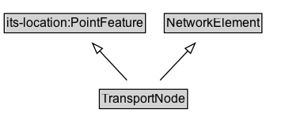

# TransportNode

A point feature at which network links may meet or which anchors linear topology.

## Diagram

=== "SVG (interactive)"

    <!-- Generated by graphviz version 14.1.3 (20260303.0454)
     -->
    <!-- Pages: 1 -->
    <svg width="270pt" height="132pt"
     viewBox="0.00 0.00 270.00 132.00" xmlns="http://www.w3.org/2000/svg" xmlns:xlink="http://www.w3.org/1999/xlink">
    <g id="graph0" class="graph" transform="scale(1 1) rotate(0) translate(4 128)">
    <polygon fill="white" stroke="none" points="-4,4 -4,-128 265.88,-128 265.88,4 -4,4"/>
    <g id="clust3" class="cluster">
    <title>cluster_associated</title>
    </g>
    <!-- its&#45;location_PointFeature -->
    <g id="node1" class="node">
    <title>its&#45;location_PointFeature</title>
    <g id="a_node1"><a xlink:href="https://w3id.org/itsdata/location/v1/PointFeature" xlink:title="&lt;TABLE&gt;">
    <polygon fill="lightgray" stroke="none" points="1,-97.88 1,-114.12 132.75,-114.12 132.75,-97.88 1,-97.88"/>
    <text xml:space="preserve" text-anchor="start" x="2" y="-101.88" font-family="Arial" font-size="12.00">its&#45;location:PointFeature</text>
    <polygon fill="none" stroke="black" points="0,-96.88 0,-115.12 133.75,-115.12 133.75,-96.88 0,-96.88"/>
    </a>
    </g>
    </g>
    <!-- NetworkElement -->
    <g id="node2" class="node">
    <title>NetworkElement</title>
    <g id="a_node2"><a xlink:href="../NetworkElement" xlink:title="&lt;TABLE&gt;">
    <polygon fill="lightgray" stroke="none" points="152.62,-97.88 152.62,-114.12 243.12,-114.12 243.12,-97.88 152.62,-97.88"/>
    <text xml:space="preserve" text-anchor="start" x="153.62" y="-101.88" font-family="Arial" font-size="12.00">NetworkElement</text>
    <polygon fill="none" stroke="black" points="151.62,-96.88 151.62,-115.12 244.12,-115.12 244.12,-96.88 151.62,-96.88"/>
    </a>
    </g>
    </g>
    <!-- TransportNode -->
    <g id="node3" class="node">
    <title>TransportNode</title>
    <g id="a_node3"><a xlink:href="../TransportNode" xlink:title="&lt;TABLE&gt;">
    <polygon fill="lightgray" stroke="none" points="91.12,-25.88 91.12,-42.12 172.62,-42.12 172.62,-25.88 91.12,-25.88"/>
    <text xml:space="preserve" text-anchor="start" x="92.12" y="-29.88" font-family="Arial" font-size="12.00">TransportNode</text>
    <polygon fill="none" stroke="black" points="90.12,-24.88 90.12,-43.12 173.62,-43.12 173.62,-24.88 90.12,-24.88"/>
    </a>
    </g>
    </g>
    <!-- TransportNode&#45;&gt;its&#45;location_PointFeature -->
    <g id="edge1" class="edge">
    <title>TransportNode&#45;&gt;its&#45;location_PointFeature</title>
    <path fill="none" stroke="black" d="M116.29,-51.79C108.48,-60.19 98.88,-70.53 90.22,-79.86"/>
    <polygon fill="none" stroke="black" points="87.88,-77.24 83.64,-86.95 93.01,-82 87.88,-77.24"/>
    </g>
    <!-- TransportNode&#45;&gt;NetworkElement -->
    <g id="edge2" class="edge">
    <title>TransportNode&#45;&gt;NetworkElement</title>
    <path fill="none" stroke="black" d="M147.7,-51.79C155.63,-60.19 165.38,-70.53 174.17,-79.86"/>
    <polygon fill="none" stroke="black" points="171.45,-82.08 180.86,-86.95 176.55,-77.28 171.45,-82.08"/>
    </g>
    <!-- Invis -->
    </g>
    </svg>

=== "PNG"

    

## Specializations of TransportNode

| Class | Description |
|-------|-------------|
| [Junction](Junction.md) | A transport node where two or more travelled ways or links connect. |

## Formalization for TransportNode

| Property | Constraint |
|----------|------------|
| subClassOf | [its-location:PointFeature](https://w3id.org/itsdata/location/v1/PointFeature) |
| subClassOf | [NetworkElement](NetworkElement.md) |

