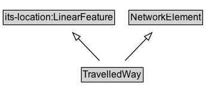

# TravelledWay

A linear feature representing a generic travelled way (centreline or reference line).

## Diagram

=== "SVG (interactive)"

    <!-- Generated by graphviz version 14.1.3 (20260303.0454)
     -->
    <!-- Pages: 1 -->
    <svg width="272pt" height="132pt"
     viewBox="0.00 0.00 272.00 132.00" xmlns="http://www.w3.org/2000/svg" xmlns:xlink="http://www.w3.org/1999/xlink">
    <g id="graph0" class="graph" transform="scale(1 1) rotate(0) translate(4 128)">
    <polygon fill="white" stroke="none" points="-4,4 -4,-128 267.88,-128 267.88,4 -4,4"/>
    <g id="clust3" class="cluster">
    <title>cluster_associated</title>
    </g>
    <!-- its&#45;location_LinearFeature -->
    <g id="node1" class="node">
    <title>its&#45;location_LinearFeature</title>
    <g id="a_node1"><a xlink:href="https://w3id.org/itsdata/location/v1/LinearFeature" xlink:title="&lt;TABLE&gt;">
    <polygon fill="lightgray" stroke="none" points="1,-97.88 1,-114.12 138.75,-114.12 138.75,-97.88 1,-97.88"/>
    <text xml:space="preserve" text-anchor="start" x="2" y="-101.88" font-family="Arial" font-size="12.00">its&#45;location:LinearFeature</text>
    <polygon fill="none" stroke="black" points="0,-96.88 0,-115.12 139.75,-115.12 139.75,-96.88 0,-96.88"/>
    </a>
    </g>
    </g>
    <!-- NetworkElement -->
    <g id="node2" class="node">
    <title>NetworkElement</title>
    <g id="a_node2"><a xlink:href="../NetworkElement" xlink:title="&lt;TABLE&gt;">
    <polygon fill="lightgray" stroke="none" points="158.62,-97.88 158.62,-114.12 249.12,-114.12 249.12,-97.88 158.62,-97.88"/>
    <text xml:space="preserve" text-anchor="start" x="159.62" y="-101.88" font-family="Arial" font-size="12.00">NetworkElement</text>
    <polygon fill="none" stroke="black" points="157.62,-96.88 157.62,-115.12 250.12,-115.12 250.12,-96.88 157.62,-96.88"/>
    </a>
    </g>
    </g>
    <!-- TravelledWay -->
    <g id="node3" class="node">
    <title>TravelledWay</title>
    <g id="a_node3"><a xlink:href="../TravelledWay" xlink:title="&lt;TABLE&gt;">
    <polygon fill="lightgray" stroke="none" points="99.12,-25.88 99.12,-42.12 174.62,-42.12 174.62,-25.88 99.12,-25.88"/>
    <text xml:space="preserve" text-anchor="start" x="100.12" y="-29.88" font-family="Arial" font-size="12.00">TravelledWay</text>
    <polygon fill="none" stroke="black" points="98.12,-24.88 98.12,-43.12 175.62,-43.12 175.62,-24.88 98.12,-24.88"/>
    </a>
    </g>
    </g>
    <!-- TravelledWay&#45;&gt;its&#45;location_LinearFeature -->
    <g id="edge1" class="edge">
    <title>TravelledWay&#45;&gt;its&#45;location_LinearFeature</title>
    <path fill="none" stroke="black" d="M120.81,-51.79C112.76,-60.19 102.86,-70.53 93.94,-79.86"/>
    <polygon fill="none" stroke="black" points="91.53,-77.32 87.14,-86.96 96.58,-82.16 91.53,-77.32"/>
    </g>
    <!-- TravelledWay&#45;&gt;NetworkElement -->
    <g id="edge2" class="edge">
    <title>TravelledWay&#45;&gt;NetworkElement</title>
    <path fill="none" stroke="black" d="M152.94,-51.79C160.99,-60.19 170.89,-70.53 179.81,-79.86"/>
    <polygon fill="none" stroke="black" points="177.17,-82.16 186.61,-86.96 182.22,-77.32 177.17,-82.16"/>
    </g>
    <!-- Invis -->
    </g>
    </svg>

=== "PNG"

    

## Specializations of TravelledWay

| Class | Description |
|-------|-------------|
| [Footpath](Footpath.md) | A travelled way intended primarily for pedestrians. |
| [Micromobility Path](MicromobilityPath.md) | A travelled way intended for micromobility modes. |
| [Road](Road.md) | A travelled way intended for motor vehicle or mixed road traffic. |

## Formalization for TravelledWay

| Property | Constraint |
|----------|------------|
| subClassOf | [its-location:LinearFeature](https://w3id.org/itsdata/location/v1/LinearFeature) |
| subClassOf | [NetworkElement](NetworkElement.md) |

